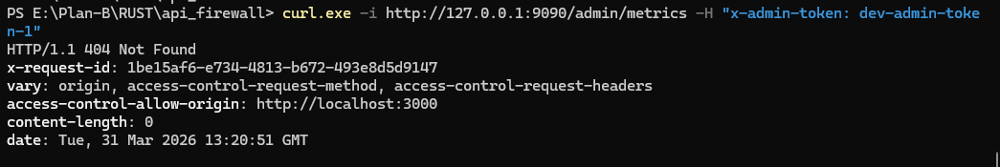
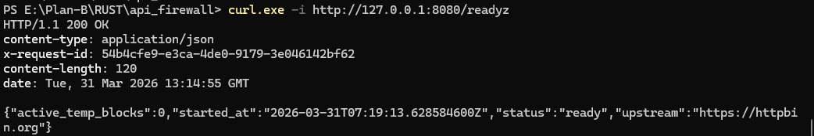
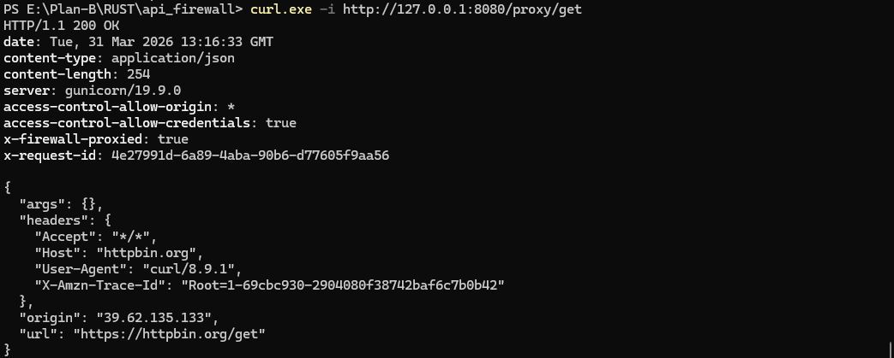
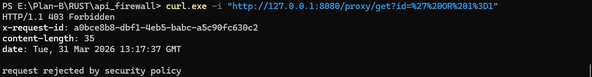

# 🛡️ UZYNTRA API Firewall — Rust Security Engine

<p align="center">
  
</p>

<p align="center">
  <b>High-Performance Rust-Based API Firewall & Threat Detection Engine</b>
</p>

<p align="center">
  <a href="https://github.com/UsamaMatrix/uzyntra-api-firewall">
    
  </a>
  <a href="https://github.com/UsamaMatrix/uzyntra-ui">
    
  </a>
  
  
</p>

---

## 🚀 Overview

**UZYNTRA API Firewall** is a **high-performance Rust-based reverse proxy security engine** designed to:

- Inspect incoming API traffic
- Detect malicious payloads
- Enforce real-time mitigations
- Provide full observability via an operator UI

It acts as a **programmable API security layer** similar to:

- OWASP ZAP (automated testing)
- WAF systems (Cloudflare / ModSecurity)
- Modern API security platforms

---

## 🚀 Why UZYNTRA?

UZYNTRA is a modern API security platform designed for real-time threat detection, analysis, and response.
Built with performance (Rust), usability (Next.js), and security-first principles, it provides a complete control plane + data plane architecture for protecting APIs at scale.

---

## 🔗 UI Dashboard

This backend is controlled via:

👉 **UZYNTRA UI (Operator Console)**  
https://github.com/UsamaMatrix/uzyntra-ui

---

## ⚡ Core Capabilities

- 🔍 **Deep Request Inspection**
  - Query, headers, body analysis
  - Pattern-based + heuristic detection

- 🧠 **Attack Detection Engine**
  - SQL Injection (basic detection)
  - Suspicious payload classification
  - Extensible rule system

- 🛡️ **Active Mitigation System**
  - IP blocking
  - Temporary bans (TTL-based)
  - Manual analyst actions

- 📊 **Security Telemetry**
  - Event logging
  - Metrics tracking
  - Audit trail generation

- ⚙️ **Policy Control**
  - Rule modes (detect / block)
  - Route-specific overrides
  - Rate limiting

- ⚡ **High Performance**
  - Built with async Rust
  - Tokio runtime
  - Low-latency proxying

---

## 🎬 Engine Concept (GIF)

<p align="center">
  
</p>

---

## 📸 API & System Screenshots

### 📊 Metrics API


### 🔍 Events API Response


### 🛡️ Mitigations API


### ⚙️ Policy API


---

## 🧰 Tech Stack

- 🦀 Rust (Stable)
- ⚡ Tokio (async runtime)
- 🌐 Axum (web framework)
- 🔗 Reqwest (HTTP client)
- 📦 Serde (serialization)
- 🧠 Custom security engine

---

## 📦 Installation

```bash
git clone https://github.com/UsamaMatrix/uzyntra-api-firewall.git
cd uzyntra-api-firewall
cargo build
````

---

## ▶️ Running the Server

```bash
cargo run
```

---

## 🌐 Default Endpoints

| Service      | URL                                                            |
| ------------ | -------------------------------------------------------------- |
| Proxy        | [http://127.0.0.1:8080](http://127.0.0.1:8080)                 |
| Admin API    | [http://127.0.0.1:9090](http://127.0.0.1:9090)                 |
| Health Check | [http://127.0.0.1:8080/healthz](http://127.0.0.1:8080/healthz) |
| Readiness    | [http://127.0.0.1:8080/readyz](http://127.0.0.1:8080/readyz)   |

---

## 🔐 Admin Authentication

All admin endpoints require:

```http
x-admin-token: dev-admin-token-1
```

---

## 🔍 Example Requests

### Get Metrics

```bash
curl http://127.0.0.1:9090/v1/admin/metrics \
  -H "x-admin-token: dev-admin-token-1"
```

---

### Get Events

```bash
curl http://127.0.0.1:9090/v1/admin/events \
  -H "x-admin-token: dev-admin-token-1"
```

---

### Block IP

```bash
curl -X POST http://127.0.0.1:9090/v1/admin/mitigations/block \
  -H "x-admin-token: dev-admin-token-1" \
  -H "Content-Type: application/json" \
  -d '{
    "ip": "192.168.1.1",
    "reason": "manual block",
    "ttl_seconds": 600
  }'
```

---

## 📁 Project Structure

```text
src/
 ├── main.rs                 # Entry point
 ├── config/                # Config loader
 ├── proxy/                 # Reverse proxy logic
 ├── detection/             # Attack detection engine
 ├── mitigation/            # Blocking & enforcement
 ├── telemetry/             # Metrics & logging
 ├── admin/                 # Admin API routes
 ├── policy/                # Rule management
 └── models/                # Shared data structures
```

---

## 🧠 Detection Engine (Concept)

* Pattern matching (e.g., SQLi keywords)
* Request scoring
* Confidence levels
* Attack classification

Example detection:

```text
Payload: "union select 1"
→ AttackClass: SQL Injection
→ Severity: Critical
→ Confidence: 0.91
```

---

## 🛡️ Mitigation Flow

```text
Request → Inspection → Detection → Decision → Action

If malicious:
  → Log event
  → Update reputation
  → Apply block (if needed)
```

---

## ⚙️ Configuration

Located in:

```text
config/development.yaml
```

You can configure:

* upstream target
* ports
* rule modes
* rate limits

---

## 🧪 Testing Security

Try:

```bash
curl -X POST http://127.0.0.1:8080/proxy/test \
  -d "union select password from users"
```

Expected result:

```text
403 Forbidden
Request rejected by security policy
```

---

## 🧭 Roadmap

* 🔐 JWT Authentication
* 📊 Advanced analytics
* 🧠 ML-based detection
* 🌐 SaaS multi-tenant system
* 🔄 Distributed architecture
* 📡 Real-time alerting

---

## 🤝 Contribution

PRs and ideas are welcome.

---

## 👨‍💻 Author

**[Muhammad Usama](https://www.linkedin.com/in/usamamatrix/)**
Cyber Security Analyst | Rust Backend Engineer

---

## ⭐ Support

If you like this project:

* ⭐ Star it
* 🚀 Share it
* 🛠️ Build on it

---

## 🔗 Related Repository

👉 UI Console:
[https://github.com/UsamaMatrix/uzyntra-ui](https://github.com/UsamaMatrix/uzyntra-ui)

---

## 🛡️ UZYNTRA

> *Observe. Detect. Control. Defend.*
